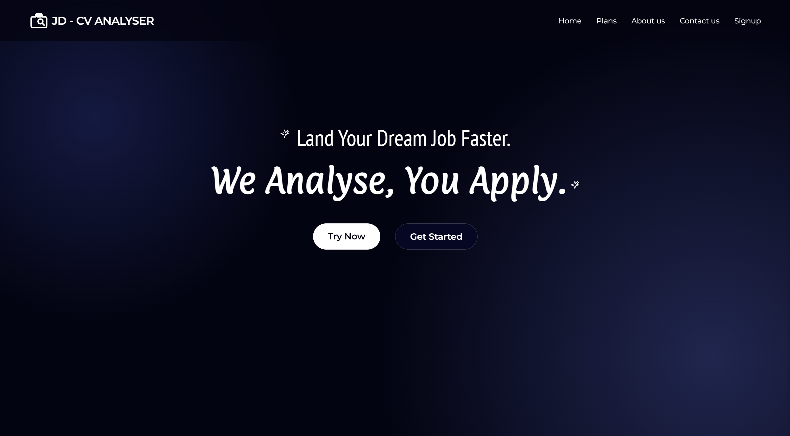
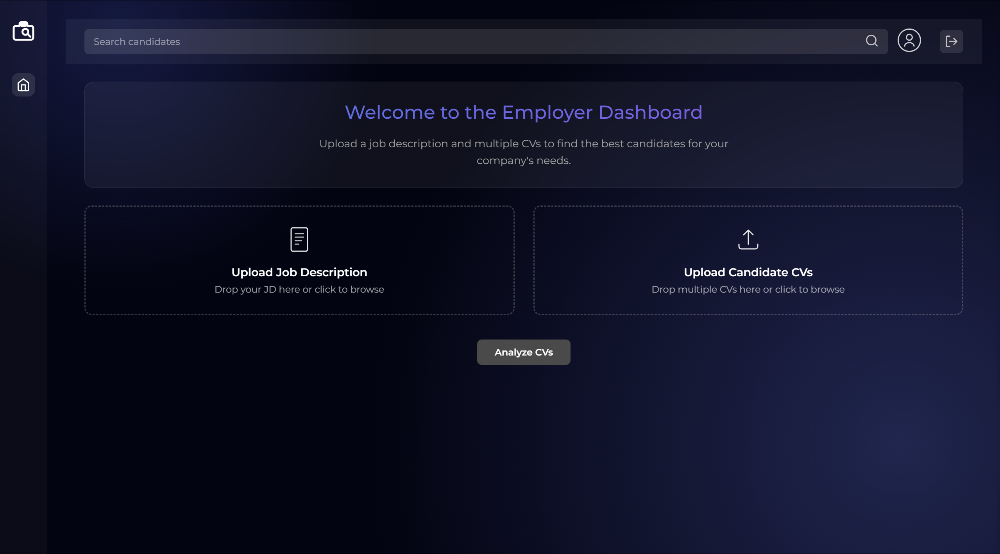
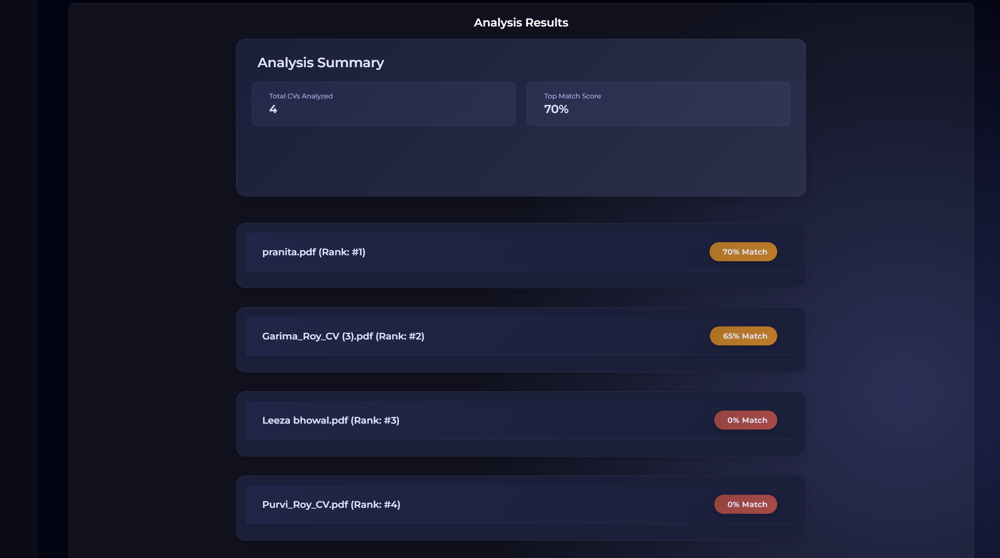

# ATS-Eureka: AI-Powered Resume Screening System

ATS-Eureka is an intelligent Applicant Tracking System that leverages AI to analyze resumes against job descriptions, providing detailed matching scores and insights for both employers and job seekers.

## 🚀 Features

- **AI-Powered Resume Analysis**: Advanced matching algorithm using Google's Gemini Flash 1.5 8B model
  - State-of-the-art language understanding
  - Fast and efficient processing
  - Accurate skill matching and analysis
  - Contextual understanding of job requirements
- **Dual Interface**: Separate portals for employers and job seekers
- **Instant Feedback**: Get detailed analysis with matching scores and skill gaps
- **Batch Processing**: Analyze multiple resumes simultaneously
- **Rate Limiting**: Managed API access with Redis-based rate limiting
- **Secure Authentication**: JWT-based authentication system

### AI Model Details

The system leverages Google's Gemini Flash 1.5 8B model, which offers:

- **Flash Attention**: Optimized attention mechanism for faster processing
- **8B Parameters**: Balanced model size for both accuracy and speed
- **Context Understanding**: Deep comprehension of both technical and non-technical roles
- **Structured Output**: Consistent JSON responses with matching scores and analysis

## 💻 Tech Stack

### Backend

- **FastAPI**: Modern Python web framework
- **MongoDB Atlas**: Cloud database for storing user data and analysis results
- **Redis Cloud**: Rate limiting and caching
- **Google Gemini AI**: Advanced language model for resume analysis
- **Docker**: Containerization
- **Heroku**: Cloud deployment platform

### Frontend

- **HTML5/CSS3**: Modern, responsive design
- **JavaScript**: Dynamic client-side functionality
- **AWS S3 & CloudFront**: Static asset hosting and CDN

## 🛠️ Installation

### Prerequisites

- Python 3.10+
- MongoDB Atlas account
- Redis Cloud account
- Google Gemini API key

### Backend Setup

1. Clone the repository

```bash
git clone https://github.com/yourusername/ATS-Eureka.git
cd ATS-Eureka
```

2. Create and activate virtual environment

```bash
python -m venv venv
.\venv\Scripts\activate
```

3. Install dependencies

```bash
pip install -r requirements.txt
```

4. Set up environment variables (.env)

```plaintext
MONGO_URI=your_mongodb_uri
SECRET_KEY=your_jwt_secret_key
GEMINI_API_KEY=your_gemini_api_key
REDIS_HOST=your_redis_host
REDIS_PORT=your_redis_port
REDIS_PASSWORD=your_redis_password
```

5. Run the application

```bash
uvicorn app:app --reload
```

## 📚 API Documentation

### Authentication Endpoints

#### Register Employer

- **POST** `/api/register/employer`

```json
{
    "company_name": "string",
    "business_email": "string",
    "password": "string",
    "confirm_password": "string"
}
```

#### Register Employee

- **POST** `/api/register/employee`

```json
{
    "full_name": "string",
    "email": "string",
    "password": "string",
    "confirm_password": "string"
}
```

#### Login

- **POST** `/api/token`

```json
{
    "username": "string",
    "password": "string",
    "user_type": "string"
}
```

### Resume Analysis Endpoints

#### Employee CV Analysis

- **POST** `/api/employee`
- **Content-Type**: `multipart/form-data`
- **Authorization**: Bearer Token

```plaintext
file: CV file (PDF/DOCX)
jd_text: Job Description text (optional)
jd_file: Job Description file (optional)
```

#### Employer Batch Analysis

- **POST** `/api/employer`
- **Content-Type**: `multipart/form-data`
- **Authorization**: Bearer Token

```plaintext
jd_text: Job Description text (optional)
jd_file: Job Description file (optional)
candidates: Multiple CV files (PDF/DOCX)
```

### Profile Endpoints

#### Get User Profile

- **GET** `/api/profile`
- **Authorization**: Bearer Token

#### Get Analysis History

- **GET** `/api/profile/history`
- **Authorization**: Bearer Token

## 📸 Screenshots

### Landing Page



<!-- Add your landing page screenshot -->

### Employer Dashboard



<!-- Add your employer dashboard screenshot -->

### Employee Analysis



<!-- Add your employee analysis page screenshot -->

## 🚀 Deployment

### Backend Deployment (Heroku)

1. Create Heroku app

```bash
heroku create your-app-name
```

2. Set environment variables

```bash
heroku config:set MONGO_URI=your_mongodb_uri
heroku config:set SECRET_KEY=your_jwt_secret_key
heroku config:set GEMINI_API_KEY=your_gemini_api_key
```

3. Deploy using Docker

```bash
heroku container:push web
heroku container:release web
```

### Frontend Deployment (AWS)

1. Build frontend assets
2. Upload to S3 bucket
3. Configure CloudFront distribution

## 📝 License

This project is licensed under the MIT License - see the [LICENSE](LICENSE) file for details.

## 👥 Contributors

- Baibhab Adhikari
- Garima Roy
- Souharda Shikhar Biswas
- Leeza Bhowal

## 🤝 Contributing

1. Fork the repository
2. Create your feature branch (`git checkout -b feature/AmazingFeature`)
3. Commit your changes (`git commit -m 'Add some AmazingFeature'`)
4. Push to the branch (`git push origin feature/AmazingFeature`)
5. Open a Pull Request
